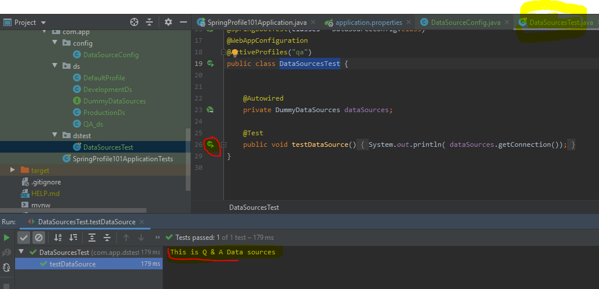

# spring_profile_101

#### Here we saw how spring profile work. 

### First see : test package
                here we create 4 profile dev,qa,prod,default.
                we can switch profile as needed.
                Run DataSourcesTest and set your desired @profile("here") and see the test
                
                image for test package

### Second see : profile package under main package as like as test package

                image for profile package

